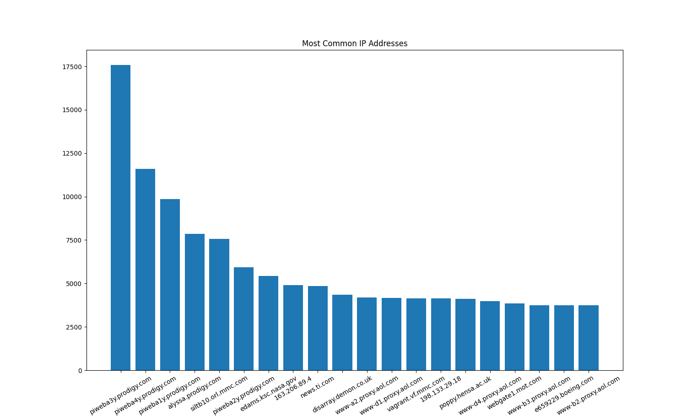
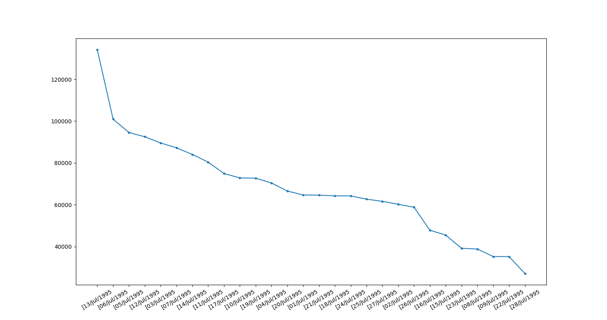

blah

*blah*

**blah**

# Heading

## Heading

### Heading

- item
- item
- item

# Introduction
I analyzed the web server log from _month_ of _1995_. See the graphs before to see what the information for the data collected. 

## Most Common IP Addresses

The first thing I analyzed was the ___flow of traffic___ via the ___DNS addresses.DNS stands for Domain Name System. A DNS is a way for the internet to know what website matches with which IP address. In this case, the people who accessed the Nasa file were recorded based on the DNS they were on___. This is what I found: 
- Someone using the DNS __piweba3y.prodigy.com__ visited the most. 
- We had __20__ DNS’s recorded on the graph.
- The Least common DNS recorded was www-b2.proxy.aol.com.

## Most Common Dates

The second thing I analyzed was the ___web page visits on certian days___. Analying the ___time gives us a better understanding of when the Nasa files were.___ This is what I found: (Provide at least 3 things.) 
- The most active day was July 13th, 1995
- The least active day recorded was July 28th, 1995
- The most active day had over 120,000 visits while the next day had barely over 100,000.

## Suggestions
- Based on my analysis, to increase our web traffic, we can publicize the website on DNS's such as piweba3y.prodigy.com and siltb10.orl.mmc.com.
- ____ web page was forwarded less so we can feature it on the main page more or provide links. 
- 
